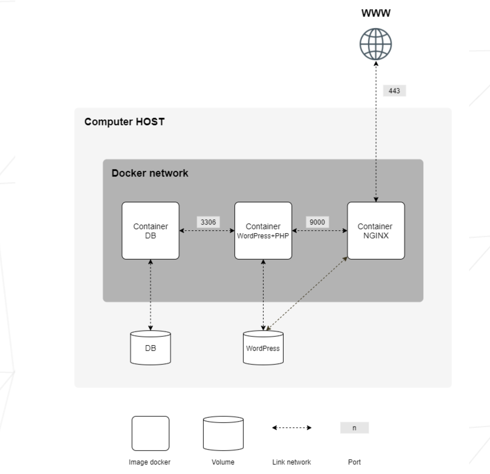

<h1 align="center">
	📖 42-inception
</h1>

<p align="center">
	
	
	
	
</p>

<h3 align="center">
	<a href="#-running-the-containers">Running</a>
</h3>


# 💡 About the project
>This document is a System Administration related exercise.

This project aims to broaden your knowledge of system administration by using Docker.
You will virtualize several Docker images, creating them in your new personal virtual
machine.

## 🚀 Running the containers 

```bash
make
```
It will automatically compile the project. Create containers, network and volumes.

---

<p align="center">
	
</p>
